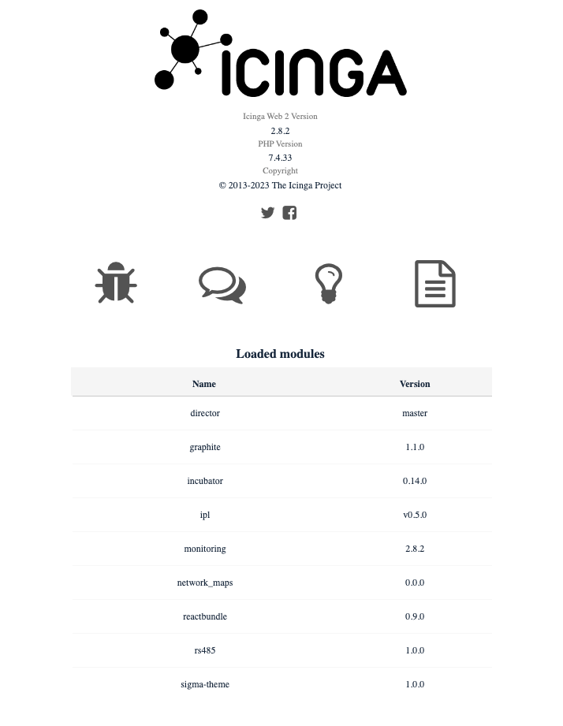

# RDSS Ansible miniPC installation


## Local Dependencies


Install sshpass `apt get install git sshpass`

Install ansible locally

Please refer to:
[Installing Ansible on specific operating systems](https://docs.ansible.com/ansible/latest/installation_guide/intro_installation.html#installing-ansible-on-specific-operating-systems)


# Get repository
Download repository from Git `git clone https://gitlab.com/itaum/rdss2.git`


## Setting up deploy environment
Enter ansible folder ``cd ./rdss2/ansible``

Edit `vars.yaml` file and change variables with yours

Define templates located at `playbooks/templates` as you desire

## Add all miniPCs to inventory

edit `inventory/hosts.yaml` file and add all miniPCs IPs
The content should be something like:

```
miniPCs:
  hosts:
    miniPC1:
      ansible_host: 165.227.192.32
    miniPC2:
      ansible_host: 192.168.60.79
    miniPC3:
      ansible_host: 192.168.60.80
```

## Provisioning miniPCs

Just execute:

`ansible-playbook --ask-pass -K main.yaml`

(will be prompted miniPC user password and sudo password)

## Post Installation

Check `monitor` and `frontend` configuration in case you need to adjust them to your specific system needs:

### monitor configuration file

Is located at: `/opt/rdss/monitor/config.py`

### frontend configuration file

Is located at: `/opt/rdss/frontend/.env.local`

### Update the software

`ansible-playbook --ask-pass -K update.yaml`

### Versions

