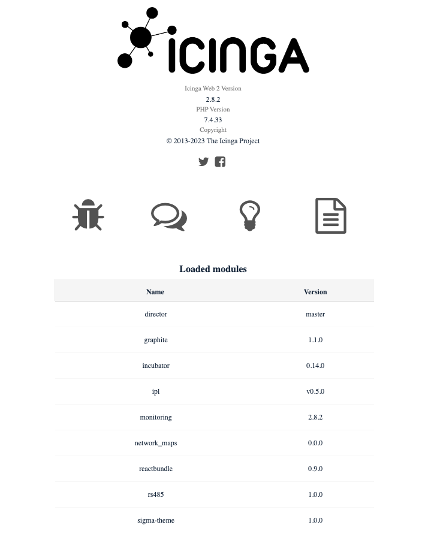

# RDSS Master installation

## Local Dependencies

Install sshpass `apt get install git sshpass`

Install ansible locally

Please refer to:
[Installing Ansible on specific operating systems](https://docs.ansible.com/ansible/latest/installation_guide/intro_installation.html#installing-ansible-on-specific-operating-systems)

### RCC tool chain for RPA actions

Download `https://downloads.robocorp.com/rcc/releases/v14.6.0/linux64/rcc`

```sh
sudo mv rcc /usr/local/bin
sudo chmod a+x /usr/local/bin/rcc
```

## Get repository

Download repository from Git `git clone https://gitlab.com/itaum/rdss2.git`

## Setting up deploy environment

Enter ansible folder ``cd ./rdss2/ansible``

Edit `vars.yaml` file and change variables with yours

Define templates located at `playbooks/templates` as you desire

## Add all miniPCs to inventory

edit `inventory/hosts.yaml` file and add all miniPCs IPs
The content should be something like:

```txt
miniPCs:
  hosts:
    miniPC1:
      ansible_host: 165.227.192.32
    miniPC2:
      ansible_host: 192.168.60.79
    miniPC3:
      ansible_host: 192.168.60.80
```

## Provisioning miniPCs

Just execute:

`install.sh`

### Versions

