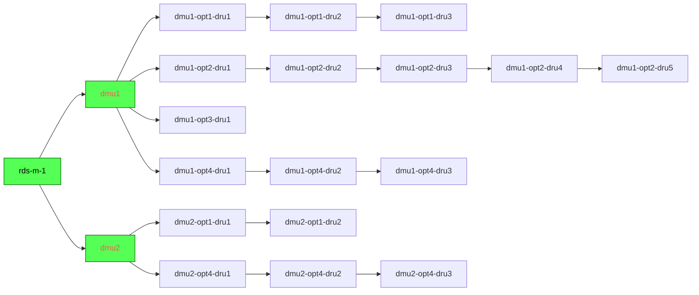

|  |
| -------------------------------------- |
|                                        |

# RDS: Remote Diagnostic System

_Distributed monitoring platform_

## Example Deployment Diagram



---

## Definitions

- `Masters Nodes` controls Satellite Nodes
- `Satellite Nodes` connects MDUs
- Each `MDU` has 4 ports where `RDUs` are connected in series

## Naming convention:

- `Master` node hostname (FQDN): rds-m-[1-..]
- `Satellite` node hostname (FQDN):: dmu[1-..]
- `MDU` ports are Services of `Satellite` host: (e.g. dmu1-opt1-dru1)

See [docs](/docs) folder for more information

# Nodes Installation

On every node clone this repository and follow specific node type instructions.

```
git clone https://gitlab.com/itaum/sigma-rds /tmp/sigma-rds
cd /tmp/sigma-rds
```

## Specific instructions for node type:

- [Install Master Node](docs/setup_master_debian.md)
- [Install Satellite Node](docs/setup_satellite_debian.md)

---

# Master WebUI Usage

Open `http://<master_hostname>/icingaweb2` in your browser.

Go to Master WebUI -> Director Module Menu:

- Add new Host Template if you don't have one yet
- Add new Service Template if you don't have one yet
- Add new Host and children Service
- Deploy changes
