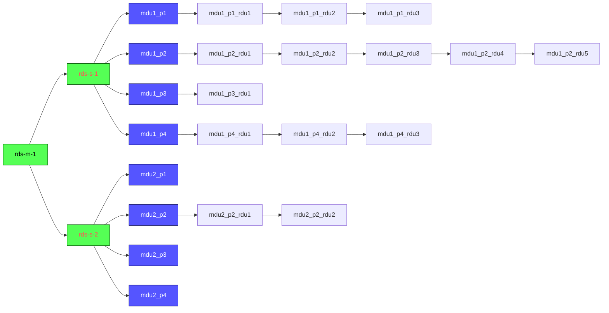

|  |
| -------------------------------------- |
|                                        |

# Sigma Telecom - RDS

Distributed monitoring platform

Name nodes as following syntax

- Master: rds-m-x
- Satellites: rds-s-y

Satellite MDU port are Services

See [docs](/docs) folder for more information



---

## Node Installation

On every node clone this repository and follow specific node type instructions.

```
git clone https://gitlab.com/itaum/sigma-rds /tmp/sigma-rds
cd /tmp/sigma-rds
git checkout development
```

### Specific instructions for:

- [Master Nodes](docs/setup_master_debian.md)
- [Satellite Nodes](docs/setup_satellite_debian.md)

---

## Usage

Go to Master WebUI -> Director Module Menu:

- Add new Host Template if you don't have one yet
- Add new Service Template if you don't have one yet
- Add new Host and children Service
- Deploy changes
